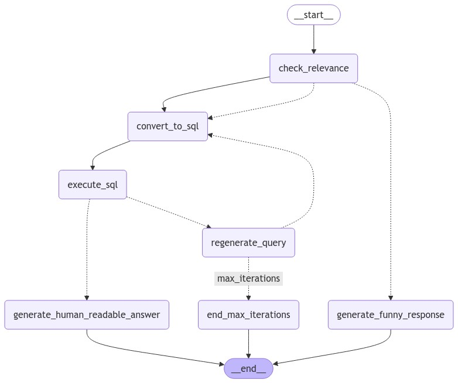

# SQL-Agent with LangGraph, LangChain and LLM
This repository contains a SQL Agent that converts natural language questions into SQL queries, executes the queries on a MySQL database (can be used on any database), and provides human-readable responses. It utilizes OpenAI’s ChatGPT, LangChain, and SQLAlchemy to interpret natural language inputs and interact with a database. Any LLM can be used instead of ChatGPT.

## Features
- Converts natural language questions to SQL.
- Executes SQL queries on a database with pre-defined tables.
- Returns formatted, user-friendly query results.
- Checks if a question is relevant to the database schema.
- Provides error handling, retries, and generates alternative responses if needed.

## Prerequisites
- Python 3.8+
- OpenAI API key

## Installation

1. **Clone the Repository**

   ```bash
   git clone https://github.com/AjayKrishna76/SQL-Agent.git
   ```

2. **Install Dependencies**
    ```bash
    pip install -r requirements.txt
    ```
3. **Set Up Environment Variables**
    Create a ```.env``` file in the root directory to securely store sensitive information, like your OpenAI API key:
    ```bash
    OPENAI_API_KEY=your_openai_api_key
    ```
4. **Database Configuration**
    Configure your MySQL database connection by modifying the ```db_config``` dictionary in the code:

    ```bash
    db_config = {
    'host': 'localhost',
    'user': 'root',
    'password': 'password',
    'database': 'database'
    }
    ```
    Any database can be used here.

5. **Create the workflow**
<p align="center">
  
</p>

This workflow diagram outlines the main steps of the SQL Agent:

1. check_relevance: Determines if the question is relevant to the database schema.
2. convert_to_sql: Converts a relevant question into an SQL query.
3. execute_sql: Executes the generated SQL query on the database.
4. generate_human_readable_answer: Translates the SQL query result into a user-friendly response.
5. regenerate_query: If the query fails or is incorrect, attempts to refine and regenerate it.
6. end_max_iterations: Stops the workflow if maximum retries are reached.
7. generate_funny_response: Provides a playful response if the question is not relevant.

- Each node represents a function, with arrows indicating the flow between stages. The workflow ends successfully at generate_human_readable_answer or end_max_iterations if retries are exhausted.
